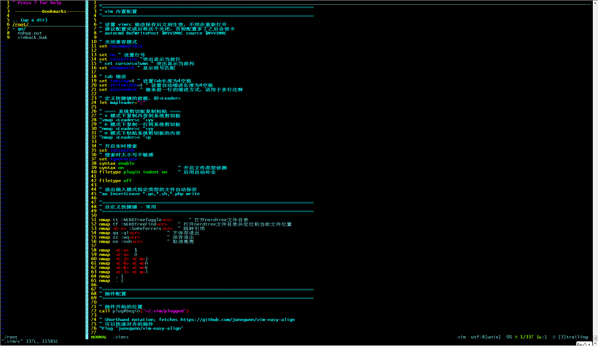
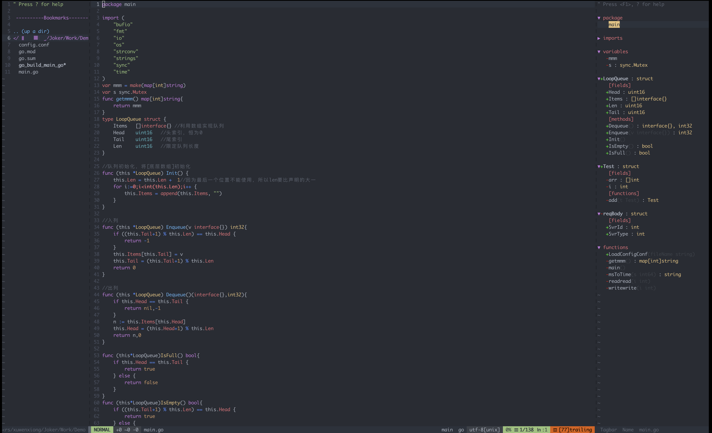

# 个人VIM配置 - mac&linux

> mac支持golang相关配置,linux暂未支持(调试未通过,目前仅配置了快捷键、配色等通用插件)

~~~bash
# 使用Plug管理vim插件
$ curl -fLo ~/.vim/autoload/plug.vim --create-dirs https://raw.githubusercontent.com/junegunn/vim-plug/master/plug.vim

#linux(win环境通过secureCRT登录后配色仍然生效 - CRT需设置Xterm ANSI颜色)
$ cd ~ && wget https://raw.githubusercontent.com/Joker1222/Personal-IDE-Config/main/vim/linux_secureCRT.vimrc && mv linux_secureCRT.vimrc .vimrc  

#mac环境使用的插件多一些,配置起来稍微比较麻烦
$ cd ~ && wget https://raw.githubusercontent.com/Joker1222/Personal-IDE-Config/main/vim/mac_iterm.vimrc && mv mac_iterm.vimrc .vimrc      

$ :PlugInstall                              #拷贝vimrc后安装插件 - linux到这一步就ok了
~~~

## Mac的配置过程

**安装vim-go**
~~~bash
$ apt-get install ctags    #(mac brew安装)
$ apt-get install gtags 
:GoInstallBinaries
~~~

**安装YouCompleteMe (python3.6以上)**
~~~bash
# 安装python3.6
$ apt-get install zlib1g-dev 
$ mkdir -p /opt/python3 && cd /opt/python3/
$ wget https://www.python.org/ftp/python/3.6.1/Python-3.6.1.tgz
$ tar -zxvf Python-3.6.1.tgz
$ cd Python-3.6.1 && ./configure --prefix=/usr/local/python3 && make && make install
~~~

~~~bash
# 安装YouCompleteMe
$ apt install build-essential cmake python3-dev
$ cd ~/.vim/plugged/YouCompleteMe
$ python3 install.py --go-completer #编译，并加入 go 的支持
~~~

## Linux效果

## Mac效果

